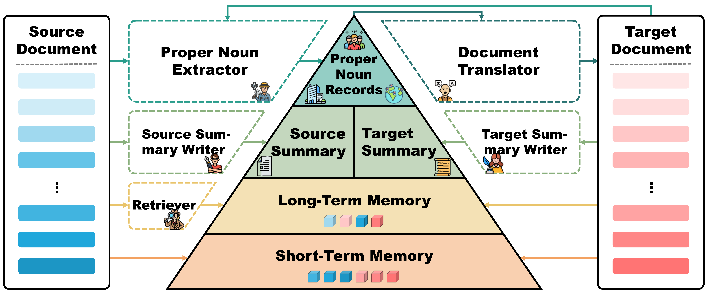

# DocMTAgent
This repository releases the codes and data for the paper -- [DelTA: An Online Document-Level Translation Agent Based on Multi-Level Memory](https://arxiv.org/abs/2410.08143).

<div align="center">
    </img>
    <p class="image-caption">DelTA: An Online Document-Level Translation Agent Based on Multi-Level Memory</p>
</div>


## **📣 News**

- **[10/10/2024] Our code and dataset for DelTA is released!**
- **[11/10/2024] Our paper is published on arXiv: [arXiv:2410.08143](https://arxiv.org/abs/2410.08143)!**

## **🔗 Quick Links**

- **[About DelTA](#about)**
- **[File Structure](#structure)**
- **[Requirements](#requirements)**
- **[Quick Start](#start)**
- **[Citation](#citation)**


## **🤖 About DelTA**<a name="about"></a>
**DelTA**, which is short for **Document-levEL Translation Agent**, is an online document-level translation agent based on multi-level memory. It consists of the following four memory components:

- **Proper Noun Records**: Maintain a repository of previously encountered proper nouns and their initial translations within the document, ensuring consistency by reusing the same translation for each subsequent occurrence of the same proper noun.
- **Bilingual Summary**: Contain summaries of both the source and target texts, capturing the core meanings and genre characteristics of the documents to enhance translation coherence.
- **Long-Term Memory**: Store contextual sentences in a wide span, from which reletive sentences will be retrieved while translating subsequent sentences.
- **Short-Term Memory**: Store contextual sentences in a narrow span, which will be utilized as demonstration exemplars while translating subsequent sentences.

<div align="center">
    </img>
    <p class="image-caption">The Framework of DelTA</p>
</div>


## **📜 File Structure**<a name="structure"></a>
| Directory      | Contents                     |
| -------------- | ---------------------------- |
| [`data/`](https://github.com/YutongWang1216/DocMTAgent/tree/main/data)        | Experimental Data            |
| [`eval_consistency/`](https://github.com/YutongWang1216/DocMTAgent/tree/main/eval_consistency)  | Scripts of the LTCR-1 metric |
| [`infer/`](https://github.com/YutongWang1216/DocMTAgent/tree/main/infer)      | Testing scripts              |
| [`prompts/`](https://github.com/YutongWang1216/DocMTAgent/tree/main/prompts)  | Prompts for LLMs             |
| [`results/`](https://github.com/YutongWang1216/DocMTAgent/tree/main/results)  | Testing outputs              |


## **🛠️ Requirements**<a name="requirements"></a>
DelTA with Qwen as backbone models is developed with [HuggingFaces's transformers](https://github.com/huggingface/transformers), DelTA with GPT as backbone models is developed with [OpenAI API](https://openai.com/index/openai-api/)
- Python 3.9.19
- Pytorch 2.4.1+cu121
- transformers==4.45
- accelerate==0.34.2
- spacy==3.7.4
- numpy==2.0.2
- openai==1.51.2

## **🚀 Quick Start**<a name="start"></a>

### **Installation**

```bash
git clone https://github.com/YutongWang1216/DocMTAgent.git
cd DocMTAgent
pip install -r requirments.txt
```

### **Inference with DelTA**

(1) **GPT as backbone models**

- [infer/run_infer_gpt.sh](https://github.com/YutongWang1216/DocMTAgent/tree/main/infer/run_infer_gpt.sh)

Make sure to fill in the following parameters before running:

```bash
lang=en-zh                         # translation direction, choices=[en-zh,en-de,en-fr,en-ja,zh-en,de-en,fr-en,ja-en]
use_model=gpt35turbo               # GPT model, choices=[gpt35turbo,gpt4omini]
src=/path/to/src/file              # path to source document
ref=/path/to/ref/file              # path to reference document
export API_BASE=                   # base url of the API
export API_KEY=                    # API key
```

(2) **Qwen as backbone models**

- [infer/run_infer_qwen.sh](https://github.com/YutongWang1216/DocMTAgent/tree/main/infer/run_infer_qwen.sh)

Make sure to fill in the following parameters before running:

```bash
lang=en-zh                         # translation direction, choices=[en-zh,en-de,en-fr,en-ja,zh-en,de-en,fr-en,ja-en]
use_model=qwen2-7b-instruct        # GPT model, choices=[qwen2-7b-instruct,qwen2-72b-instruct]
modelpathroot=/path/to/checkpoint  # path to huggingface model checkpoint
src=/path/to/src/file              # path to source document
ref=/path/to/ref/file              # path to reference document
```

### **Calculating LTCR-1 metric scores**

- [eval_consistency/run_eval.sh](https://github.com/YutongWang1216/DocMTAgent/tree/main/eval_consistency/run_eval.sh)

Make sure to fill in the following parameters before running:

```bash
lang=en-zh                         # translation direction, choices=[en-zh,en-de,en-fr,en-ja,zh-en,de-en,fr-en,ja-en]
src_file=/path/to/src/file         # path to source document
hyp_file=/path/to/hyp/file         # path to reference document
output_dir=result/                 # output path of the evaluation results
```


## **📝 Citation**<a name="citation"></a>
If you find this repo useful, please cite our paper as:
```
@misc{wang2024deltaonlinedocumentleveltranslation,
      title={DelTA: An Online Document-Level Translation Agent Based on Multi-Level Memory}, 
      author={Yutong Wang and Jiali Zeng and Xuebo Liu and Derek F. Wong and Fandong Meng and Jie Zhou and Min Zhang},
      year={2024},
      eprint={2410.08143},
      archivePrefix={arXiv},
      primaryClass={cs.CL},
      url={https://arxiv.org/abs/2410.08143}, 
}
```
