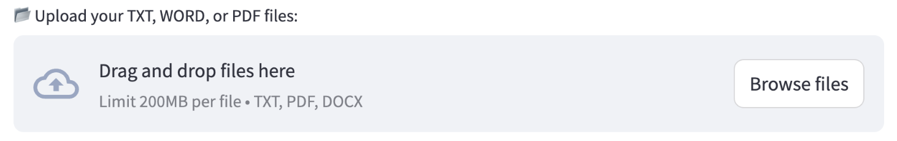

# DelTA: Document-Level Translation Agent

DelTA is a document-level translation agent designed to handle long document translations efficiently. This project provides a simple Streamlit-based UI for interacting with the translation models.

---

## Usage

### Running the Project

1. **Set Up the Environment**:
   - Navigate to the `demo` folder:
     ```bash
     git clone https://github.com/YutongWang1216/DocMTAgent.git
     cd DocMTAgent/demo
     ```
   - Install additional dependencies in your virtual environment:
     ```bash
     conda create --name myenv python=3.9
     pip install -r requirements.txt
     ```

2. **Configure the Scripts**:
   - Modify the following lines in `run_gpt.sh` and `run_qwen.sh`:
     - **Line 4**: Activate your virtual environment:
       ```bash
       source /PATH/TO/YOUR/CONDA/bin/activate myenv # env activate
       ```
     - **Lines 6-7**: Fill in the model path or API information:
       - For GPT models, provide the API key and base URL.
            ```bash
            export API_BASE="sk-your-openai-api-key"
            export API_KEY="https://api.openai.com/v1"
            ```
       - For Qwen models, provide the local model path. It is recommended to store the model in `DocMTAgent/demo/models/`.
            ```bash
            export Qwen2-72B-path=$(realpath models/Qwen2-72B-Instruct)
            export Qwen2-7B-path=$(realpath models/Qwen2-7B-Instruct)
            ```

3. **Run the UI**:
   - After making the above changes, start the Streamlit UI:
     ```bash
     streamlit run DelTA.py
     ```
   - The UI will launch in your browser, allowing you to interact with the translation agent.

---

## Features

### Supported File Types
The UI supports the following file types for translation:
- **TXT**
- **PDF**
- **DOCX**
### Interaction Options
1. **File Upload**:
   - Upload your document directly through the UI.

2. **Text Input**:
   - Alternatively, paste your text into the provided text box.

### Translation Process
1. **Select Language and Model**:
   - Choose the desired language pair and backbone model (Qwen or GPT).
2. **Start Translation**:
   - Click the **Translate** button to begin the translation process.
   - The UI will display real-time progress of the translation.
   

### Viewing Results
1. **In the UI**:
   - Once the translation is complete, you can view the results directly in the UI.
    
2. **In the Output Folder**:
   - The translated files are saved in `DocMTAgent/demo/data/output/` as `.txt` files for easy access.
    
---

## Notes
- **Local Models**: If using local models, ensure they are stored in `DocMTAgent/demo/models/` for seamless loading.
- **API Keys**: For GPT models, ensure your API key and base URL are correctly configured in `run_gpt.sh`.

---

Enjoy using DelTA for your document translation needs! If you encounter any issues, feel free to open an issue on our GitHub repository.
